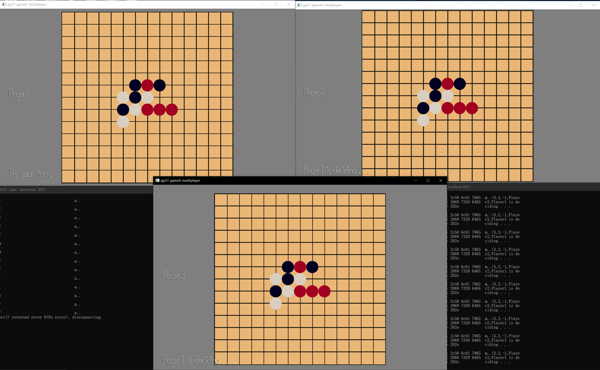

# 3 Men Connect Four

Author: Zi Wang

Design: 

Unlike usual GoBang. This is 3 Men connect four. Any player who puts four chess pieces continuously in a row/col/diag, that player wins. You don't just attack and defense. Three players would add a lot of drama and strategy in this game.

Networking: 

From client to server: The valid input. By valid, it means the mouse click that is actually within the chessboard. It is in PlayMode.cpp update.
From server to client: The last valid chess position and color. Each client's name. Each client's status (ex. Who's turn now and it's your turn to play.)

Screen Shot:

How To Play:

Press on the chesboard to place a chess piece.

Sources: 

Opengl Render program code, structure inspiration : https://github.com/GenBrg/MarryPrincess/blob/master/Texture2DProgram.cpp

This game was built with [NEST](NEST.md).

